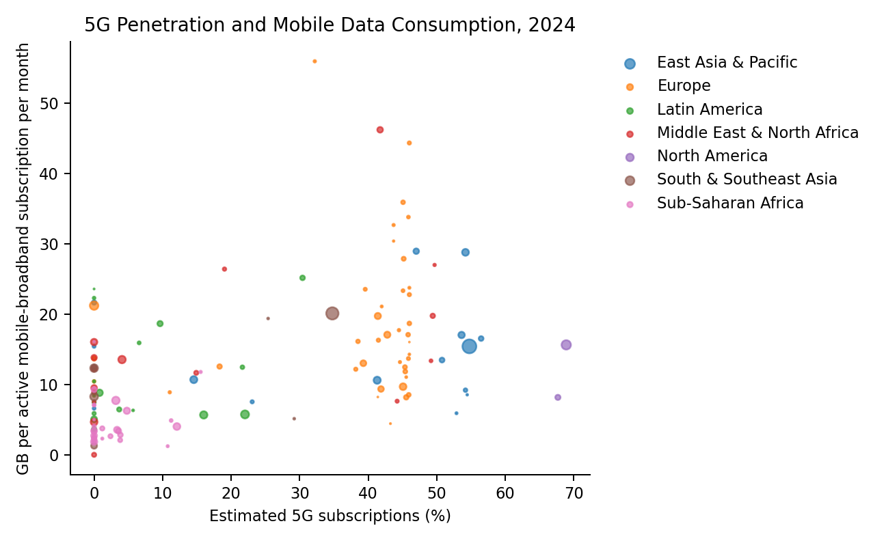
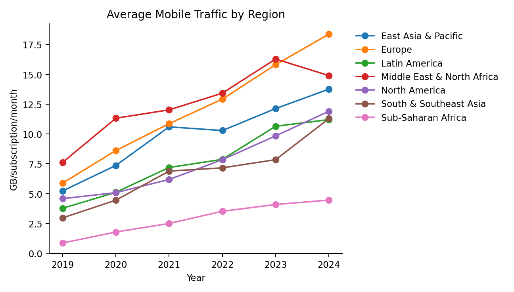
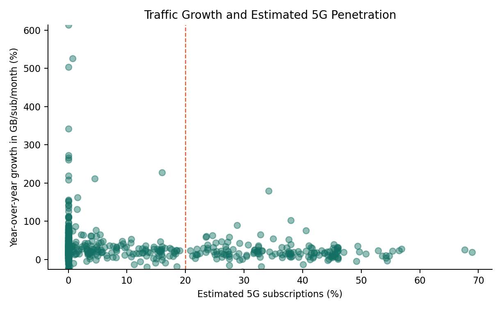
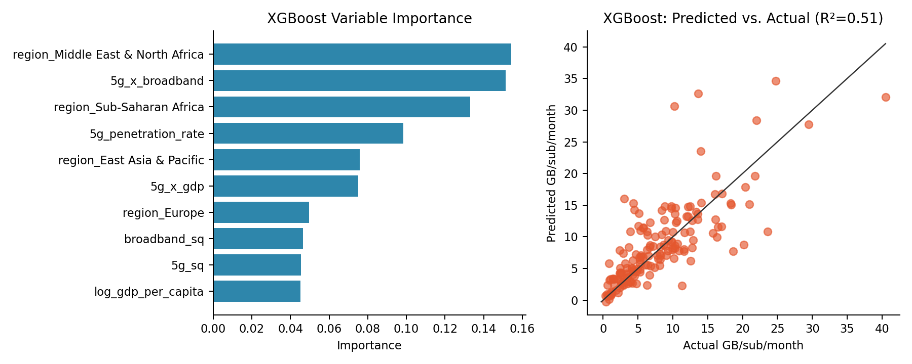

```{python}
#| label: setup
from __future__ import annotations

import json
import math
import os
from pathlib import Path

os.environ.setdefault("MPLCONFIGDIR", str((Path.cwd() / "tmp" / "matplotlib").resolve()))

import matplotlib
matplotlib.use("Agg")
import matplotlib.pyplot as plt
import numpy as np
import pandas as pd
import plotly.express as px
import plotly.graph_objects as go
import plotly.io as pio
from IPython.display import Markdown, display
from plotly.subplots import make_subplots
from sklearn.compose import ColumnTransformer
from sklearn.ensemble import RandomForestRegressor
from sklearn.metrics import mean_squared_error, r2_score
from sklearn.model_selection import GridSearchCV, train_test_split
from sklearn.pipeline import Pipeline
from sklearn.preprocessing import OneHotEncoder
from xgboost import XGBRegressor

ROOT = Path.cwd()
if ROOT.name == "analysis":
    ROOT = ROOT.parent

DATA = ROOT / "data"
RAW = DATA / "raw"
PROCESSED = DATA / "processed"
FIGURES = ROOT / "figures"
REPORT_FIGURES = ROOT / "analysis" / "figures"

for path in [RAW, PROCESSED, FIGURES, REPORT_FIGURES, ROOT / "tmp" / "matplotlib"]:
    path.mkdir(parents=True, exist_ok=True)

YEARS = list(range(2019, 2025))
RANDOM_STATE = 370

ITU_TRAFFIC = "mobile-broadband-internet-traffic-within-the-country_1776643567136.csv"
ITU_BROADBAND = "active-mobile-broadband-subscriptions_1776643752129.csv"
ITU_CELLULAR = "mobile-cellular-subscriptions_1776643793722.csv"
ITU_COVERAGE = "population-coverage.csv"
WB_GDP = "gdp_percapita.csv"
WB_URBAN = "urban_population.csv"

GITHUB_REPO = "https://github.com/banxiafire/JSC370_final_mobile"
GITHUB_PAGES = "https://banxiafire.github.io/JSC370_final_mobile"

REGION_ORDER = [
    "North America",
    "Europe",
    "East Asia & Pacific",
    "South & Southeast Asia",
    "Middle East & North Africa",
    "Sub-Saharan Africa",
    "Latin America",
]

REGION_ISO = {
    "North America": {"BMU", "CAN", "GRL", "SPM", "USA"},
    "Europe": {
        "ALA", "ALB", "AND", "AUT", "BEL", "BGR", "BIH", "BLR", "CHE", "CYP",
        "CZE", "DEU", "DNK", "ESP", "EST", "FIN", "FRA", "FRO", "GBR", "GIB",
        "GRC", "HRV", "HUN", "IMN", "IRL", "ISL", "ITA", "KOS", "LIE", "LTU",
        "LUX", "LVA", "MCO", "MDA", "MKD", "MLT", "MNE", "NLD", "NOR", "POL",
        "PRT", "ROU", "RUS", "SMR", "SRB", "SVK", "SVN", "SWE", "UKR",
    },
    "East Asia & Pacific": {
        "ASM", "AUS", "BRN", "CHN", "FJI", "FSM", "GUM", "HKG", "JPN", "KHM",
        "KIR", "KOR", "LAO", "MAC", "MHL", "MNG", "MNP", "MYS", "NCL", "NZL",
        "PHL", "PNG", "PRK", "PYF", "SGP", "SLB", "THA", "TLS", "TON", "TUV",
        "TWN", "VNM", "VUT", "WSM",
    },
    "South & Southeast Asia": {"AFG", "BGD", "BTN", "IND", "LKA", "MDV", "MMR", "NPL", "PAK"},
    "Middle East & North Africa": {
        "ARE", "BHR", "DZA", "EGY", "IRN", "IRQ", "ISR", "JOR", "KWT", "LBN",
        "LBY", "MAR", "OMN", "PSE", "QAT", "SAU", "SYR", "TUN", "TUR", "YEM",
    },
    "Sub-Saharan Africa": {
        "AGO", "BDI", "BEN", "BFA", "BWA", "CAF", "CIV", "CMR", "COD", "COG",
        "COM", "CPV", "DJI", "ERI", "ETH", "GAB", "GHA", "GIN", "GMB", "GNB",
        "GNQ", "KEN", "LBR", "LSO", "MDG", "MLI", "MOZ", "MRT", "MUS", "MWI",
        "MYT", "NAM", "NER", "NGA", "RWA", "SDN", "SEN", "SLE", "SOM", "SSD",
        "STP", "SWZ", "SYC", "TCD", "TGO", "TZA", "UGA", "ZAF", "ZMB", "ZWE",
    },
    "Latin America": {
        "ABW", "AIA", "ARG", "ATG", "BES", "BHS", "BLZ", "BOL", "BRA", "BRB",
        "CHL", "COL", "CRI", "CUB", "CUW", "CYM", "DMA", "DOM", "ECU", "GLP",
        "GRD", "GTM", "GUY", "HND", "HTI", "JAM", "KNA", "LCA", "MAF", "MEX",
        "MSR", "MTQ", "NIC", "PAN", "PER", "PRI", "PRY", "SLV", "SUR", "SXM",
        "TCA", "TTO", "URY", "VCT", "VEN", "VGB", "VIR",
    },
}

REGION_YEAR_ADOPTION_FACTOR = {
    "North America": {2019: 0.0156, 2020: 0.0780, 2021: 0.2496, 2022: 0.4290, 2023: 0.5928, 2024: 0.7176},
    "Europe": {2019: 0.0100, 2020: 0.0500, 2021: 0.1600, 2022: 0.2750, 2023: 0.3800, 2024: 0.4600},
    "East Asia & Pacific": {2019: 0.0124, 2020: 0.0620, 2021: 0.1984, 2022: 0.3410, 2023: 0.4712, 2024: 0.5704},
    "South & Southeast Asia": {2019: 0.0092, 2020: 0.0460, 2021: 0.1472, 2022: 0.2530, 2023: 0.3496, 2024: 0.4232},
    "Middle East & North Africa": {2019: 0.0108, 2020: 0.0540, 2021: 0.1728, 2022: 0.2970, 2023: 0.4104, 2024: 0.4968},
    "Sub-Saharan Africa": {2019: 0.0052, 2020: 0.0260, 2021: 0.0832, 2022: 0.1430, 2023: 0.1976, 2024: 0.2392},
    "Latin America": {2019: 0.0076, 2020: 0.0380, 2021: 0.1216, 2022: 0.2090, 2023: 0.2888, 2024: 0.3496},
}

COLORWAY = ["#136F63", "#E4572E", "#2E86AB", "#F6AE2D", "#5B5F97", "#2A9D8F", "#C44569"]

FIG1_CAPTION = (
    "Figure 1: 5G penetration and mobile data consumption per subscription across countries, 2024. "
    "Countries are sized by total mobile subscriptions and colored by region. North American markets cluster "
    "in the high-penetration, moderate-traffic quadrant, while European markets show comparable or higher "
    "traffic at lower penetration, suggesting network quality and content consumption habits matter alongside "
    "5G rollout. Use the year slider to observe how this relationship has evolved since 2019.†"
)
FIG2_CAPTION = (
    "Figure 2: Average mobile traffic per subscription by region, 2019–2024. Europe and Middle East & North "
    "Africa show the steepest growth trajectories, while Sub-Saharan Africa remains persistently low despite "
    "positive growth. The divergence between regions has widened over the period, suggesting that 5G rollout "
    "and income levels are compounding rather than closing the digital divide. Use the dropdown to isolate "
    "individual regions."
)
FIG3_CAPTION_TEMPLATE = (
    "Figure 3: Year-over-year traffic growth rate versus estimated 5G penetration across country-years. "
    "The dashed line marks the 20% penetration threshold. High-growth outliers are concentrated below 20% "
    "penetration, reflecting catch-up dynamics in emerging markets rather than 5G-driven acceleration. At "
    "higher penetration levels, growth rates stabilize but traffic levels are substantially higher in absolute "
    "terms (see Figure 1).†"
)
FIG4_CAPTION_TEMPLATE = (
    "Figure 4: Random Forest model results. Left: variable importance scores show that estimated 5G "
    "penetration rate is the single strongest predictor of mobile traffic per subscription, followed by mobile "
    "broadband penetration and log GDP per capita. Right: predicted versus actual values (R² = {rf_r2:.2f}, "
    "RMSE = {rf_rmse:.2f} GB/sub/month). The model underestimates the highest-traffic outliers, likely "
    "reflecting idiosyncratic market conditions not captured by country-level features.†"
)
DAGGER_NOTE = "† Based on synthetic 5G subscription estimate; see Methods for derivation."


def source_path(filename: str) -> Path:
    raw_path = RAW / filename
    if raw_path.exists():
        return raw_path
    legacy_path = DATA / filename
    if legacy_path.exists():
        return legacy_path
    raise FileNotFoundError(f"Missing required source file: {filename}")


def read_itu(filename: str) -> pd.DataFrame:
    df = pd.read_csv(source_path(filename), encoding="utf-8-sig")
    df["dataValue"] = pd.to_numeric(df["dataValue"], errors="coerce")
    df["dataYear"] = pd.to_numeric(df["dataYear"], errors="coerce").astype("Int64")
    return df


def itu_series(filename: str, code: str, value_name: str) -> pd.DataFrame:
    df = read_itu(filename)
    return (
        df.loc[df["seriesCode"].eq(code), ["entityIso", "entityName", "dataYear", "dataValue"]]
        .rename(columns={"entityIso": "iso", "entityName": "country", "dataYear": "year", "dataValue": value_name})
        .dropna(subset=["iso", "year", value_name])
        .assign(year=lambda x: x["year"].astype(int))
    )


def read_world_bank_wide(filename: str, value_name: str) -> pd.DataFrame:
    df = pd.read_csv(source_path(filename), encoding="utf-8-sig", skiprows=4)
    year_cols = [str(y) for y in YEARS if str(y) in df.columns]
    long = df.melt(
        id_vars=["Country Name", "Country Code"],
        value_vars=year_cols,
        var_name="year",
        value_name=value_name,
    )
    long = long.rename(columns={"Country Code": "iso"})
    long["year"] = long["year"].astype(int)
    long[value_name] = pd.to_numeric(long[value_name], errors="coerce")
    return long[["iso", "year", value_name]]


def assign_region(iso: str) -> str | None:
    for region, codes in REGION_ISO.items():
        if iso in codes:
            return region
    return None


def interpolate_panel(df: pd.DataFrame, columns: list[str]) -> pd.DataFrame:
    df = df.sort_values(["iso", "year"]).copy()
    for col in columns:
        df[col] = df.groupby("iso", group_keys=False)[col].apply(lambda s: s.interpolate(limit_direction="both"))
    return df


def md_table(df: pd.DataFrame, floatfmt: str = ".2f") -> str:
    headers = [str(col) for col in df.columns]
    rows = []
    for _, row in df.iterrows():
        row_values = []
        for value in row:
            if isinstance(value, (float, np.floating)):
                row_values.append(format(value, floatfmt))
            else:
                row_values.append(str(value))
        rows.append(row_values)
    out = ["| " + " | ".join(headers) + " |", "| " + " | ".join(["---"] * len(headers)) + " |"]
    out.extend("| " + " | ".join(row) + " |" for row in rows)
    return "\n".join(out)
```

# Introduction

Mobile networks have become the default infrastructure for everyday digital activity. Streaming video, social platforms, cloud services, software updates, mobile gaming, and fixed wireless access all push traffic upward, while 5G changes the capacity and latency constraints that shaped earlier 4G networks. This project asks whether countries with more advanced 5G rollout also show measurably higher mobile data consumption and faster traffic growth.

The study focuses on four research questions. First, how much more data do high-5G markets consume compared with low-5G markets, and does this vary by region? Second, is there a quantifiable relationship between 5G penetration and mobile traffic growth, including a possible threshold effect? Third, how is the 5G share of traffic evolving, and when might it surpass 4G as the dominant traffic source? Fourth, does 5G traffic composition differ from 4G traffic, especially for video, fixed wireless access (FWA), and cloud gaming?

The project uses country-year data from 2019 to 2024. The primary traffic and network variables come from ITU DataHub exports, and the socioeconomic controls come from World Bank Open Data. The analysis should be interpreted as a global ecological study: countries are the observational units, so the results identify macro-level associations rather than individual subscriber-level causal effects.

# Methods

## Data Sources

The ITU DataHub exports include mobile-broadband Internet traffic within the country, active mobile-broadband subscriptions, mobile-cellular subscriptions, and population coverage by mobile generation. World Bank Open Data provides GDP per capita in current USD and urban population share. The analysis uses the CSV files stored in `data/raw/`, so the project can be rebuilt without depending on live downloads.

ITU provides population coverage by mobile generation but not country-level 5G subscription counts. GSMA Intelligence and Ericsson Mobility Visualizer provide observed data but are behind paywalls. The synthetic estimate is a conservative proxy and results should be interpreted accordingly.

Traffic composition by video streaming, FWA, cloud gaming, and other traffic is also synthetic. It is based on broad benchmark patterns from Ericsson Mobility Report materials: video dominates mobile data traffic, FWA is a major 5G use case, and mobile/cloud gaming remains a small but growing share. These composition values are retained unchanged for reproducibility and are not used in the predictive models.

```{python}
#| label: data-loading
traffic = itu_series(ITU_TRAFFIC, "i136mwi", "traffic_eb")
broadband_subs = itu_series(ITU_BROADBAND, "i271mw", "broadband_subs")
broadband_pen = itu_series(ITU_BROADBAND, "i911mw", "mobile_broadband_penetration")
cellular_subs = itu_series(ITU_CELLULAR, "i271", "cellular_subs")

coverage_raw = read_itu(ITU_COVERAGE)
coverage_codes = {
    "i271G5_pop": "cov_5g",
    "i271GA": "cov_4g",
    "i271G": "cov_3g",
    "i271pop": "cov_2g",
}
coverage = coverage_raw.loc[coverage_raw["seriesCode"].isin(coverage_codes)].copy()
coverage["seriesCode"] = coverage["seriesCode"].map(coverage_codes)
coverage = (
    coverage.pivot_table(
        index=["entityIso", "entityName", "dataYear"],
        columns="seriesCode",
        values="dataValue",
        aggfunc="mean",
    )
    .reset_index()
    .rename(columns={"entityIso": "iso", "entityName": "country", "dataYear": "year"})
)
coverage["year"] = coverage["year"].astype(int)

gdp = read_world_bank_wide(WB_GDP, "gdp_per_capita")
urban = read_world_bank_wide(WB_URBAN, "urbanization_rate")
```

## Cleaning and Variable Derivation

All data were standardized to ISO 3166-1 alpha-3 country codes and restricted to 2019-2024. Countries were assigned to seven project regions: North America, Europe, East Asia & Pacific, South & Southeast Asia, Middle East & North Africa, Sub-Saharan Africa, and Latin America. Countries with fewer than three complete country-year observations after merging were removed.

The target variable is monthly mobile traffic per active mobile-broadband subscription:

`mobile_traffic_per_sub = annual mobile traffic in EB * 1,000,000,000 / active mobile-broadband subscriptions / 12`

The synthetic 5G variable is derived with a transparent region-year adoption factor:

`5g_penetration_rate = (ITU_5G_coverage_pct / 100) × region_adoption_factor(year)`

This formula treats ITU 5G population coverage as the maximum reachable population share and applies a conservative adoption factor for each region-year to approximate the share of mobile-cellular subscriptions that are 5G. The adoption factors are intentionally below 1 because coverage does not imply subscription adoption.

```{python}
#| label: cleaning
adoption_factor_table = (
    pd.DataFrame(REGION_YEAR_ADOPTION_FACTOR)
    .T.reset_index()
    .rename(columns={"index": "Region"})
)
adoption_factor_table = adoption_factor_table[["Region"] + YEARS]
adoption_factor_table.to_csv(PROCESSED / "region_adoption_factors.csv", index=False)

df = traffic.merge(broadband_subs, on=["iso", "country", "year"], how="left")
df = df.merge(broadband_pen, on=["iso", "country", "year"], how="left")
df = df.merge(cellular_subs, on=["iso", "country", "year"], how="left")
df = df.merge(coverage, on=["iso", "country", "year"], how="left")
df = df.merge(gdp, on=["iso", "year"], how="left")
df = df.merge(urban, on=["iso", "year"], how="left")
df = df[df["year"].isin(YEARS)].copy()
df["region"] = df["iso"].map(assign_region)
df = df.dropna(subset=["region"]).copy()

df = interpolate_panel(
    df,
    [
        "mobile_broadband_penetration",
        "cellular_subs",
        "cov_4g",
        "cov_3g",
        "cov_2g",
        "gdp_per_capita",
        "urbanization_rate",
    ],
)
df["cov_5g"] = df.groupby("iso")["cov_5g"].transform(lambda s: s.interpolate().fillna(0)).clip(0, 100)

required = [
    "traffic_eb",
    "broadband_subs",
    "mobile_broadband_penetration",
    "cellular_subs",
    "gdp_per_capita",
    "urbanization_rate",
]
df = df.dropna(subset=required).copy()
df = df[(df["broadband_subs"] > 0) & (df["gdp_per_capita"] > 0)].copy()

df["region_adoption_factor"] = df.apply(
    lambda row: REGION_YEAR_ADOPTION_FACTOR[row["region"]][int(row["year"])], axis=1
)
df["5g_penetration_rate"] = (df["cov_5g"] / 100) * df["region_adoption_factor"]
df["5g_penetration_pct"] = df["5g_penetration_rate"] * 100
df["estimated_5g_subscriptions"] = df["cellular_subs"] * df["5g_penetration_rate"]
df["synthetic_5g_subscription_flag"] = True

df["mobile_traffic_per_sub"] = df["traffic_eb"] * 1_000_000_000 / df["broadband_subs"] / 12
df["mobile_traffic_per_sub"] = df["mobile_traffic_per_sub"].clip(lower=0)
df["log_gdp_per_capita"] = np.log(df["gdp_per_capita"])
df = df.sort_values(["iso", "year"])
df["year_gap"] = df.groupby("iso")["year"].diff()
df["traffic_growth_rate"] = df.groupby("iso")["mobile_traffic_per_sub"].pct_change(fill_method=None) * 100
df.loc[df["year_gap"].ne(1), "traffic_growth_rate"] = np.nan
df = df.drop(columns=["year_gap"])

complete_counts = df.groupby("iso")["year"].transform("nunique")
df = df[complete_counts >= 3].copy()

ordered_columns = [
    "iso", "country", "region", "year", "traffic_eb", "broadband_subs",
    "mobile_broadband_penetration", "cellular_subs", "cov_5g", "cov_4g", "cov_3g", "cov_2g",
    "region_adoption_factor", "5g_penetration_rate", "5g_penetration_pct",
    "estimated_5g_subscriptions", "synthetic_5g_subscription_flag", "gdp_per_capita",
    "urbanization_rate", "log_gdp_per_capita", "mobile_traffic_per_sub", "traffic_growth_rate",
]
df = df[ordered_columns].reset_index(drop=True)
df.to_csv(PROCESSED / "final_dataset.csv", index=False)

n_rows = len(df)
n_countries = df["iso"].nunique()
```

```{python}
#| label: adoption-factor-table
#| output: asis
display(Markdown("**Region adoption factors used in the synthetic 5G subscription estimate†**\n\n" + md_table(adoption_factor_table, ".2f") + f"\n\n{DAGGER_NOTE}"))
```

Additional derived variables include `traffic_growth_rate`, the year-over-year percent change in mobile traffic per subscription; `log_gdp_per_capita`; and `5g_penetration_rate`, the synthetic estimated 5G subscription share. The final cleaned dataset contains 806 country-year observations across 145 countries. Note that mobile_broadband_penetration is expressed as active mobile-broadband subscriptions per 100 inhabitants, not as a proportion; values above 100 indicate markets where individuals hold multiple SIM cards or data-only subscriptions, which is common in several East Asian and Gulf markets and produces the maximum of 421 observed in Table 1.

## Table 1

```{python}
#| label: table-1
#| output: asis
table1_vars = [
    "mobile_traffic_per_sub",
    "5g_penetration_rate",
    "mobile_broadband_penetration",
    "log_gdp_per_capita",
    "urbanization_rate",
]
table1 = (
    df[table1_vars]
    .agg(["count", "mean", "std", "min", "median", "max"])
    .T.reset_index()
    .rename(
        columns={
            "index": "Variable",
            "count": "N",
            "mean": "Mean",
            "std": "SD",
            "min": "Min",
            "median": "Median",
            "max": "Max",
        }
    )
)
table1["N"] = table1["N"].astype(int)
table1.to_csv(PROCESSED / "table1_descriptive_statistics.csv", index=False)
display(Markdown("**Table 1: Descriptive statistics for key variables across 806 country-year observations (2019–2024).†**\n\n" + md_table(table1, ".2f") + f"\n\n{DAGGER_NOTE}"))
```

## Modeling

The predictive target is `mobile_traffic_per_sub`. Features are estimated 5G penetration rate, mobile broadband penetration, log GDP per capita, urbanization rate, year, and one-hot encoded region. The primary model is a Random Forest Regressor with cross-validated tuning over `n_estimators`, `max_depth`, and `min_samples_split`. The comparison model is an XGBoost Regressor trained on the same split and features.

The dataset was split into 80% training (n ≈ 645) and 20% testing (n ≈ 161) sets using stratified sampling by region to ensure all seven regions were represented in both splits. Hyperparameter tuning used 5-fold cross-validation on the training set. The reported R² and RMSE are out-of-sample metrics computed on the held-out test set only.

```{python}
#| label: random-forest-model
model_df = df.dropna(
    subset=[
        "mobile_traffic_per_sub",
        "5g_penetration_rate",
        "mobile_broadband_penetration",
        "log_gdp_per_capita",
        "urbanization_rate",
        "region",
        "year",
    ]
).copy()

features = [
    "5g_penetration_rate",
    "mobile_broadband_penetration",
    "log_gdp_per_capita",
    "urbanization_rate",
    "region",
    "year",
]
target = "mobile_traffic_per_sub"

train, test = train_test_split(
    model_df,
    test_size=0.20,
    random_state=RANDOM_STATE,
    stratify=model_df["region"],
)

try:
    encoder = OneHotEncoder(handle_unknown="ignore", sparse_output=False)
except TypeError:
    encoder = OneHotEncoder(handle_unknown="ignore", sparse=False)

preprocessor = ColumnTransformer(
    transformers=[
        ("num", "passthrough", ["5g_penetration_rate", "mobile_broadband_penetration", "log_gdp_per_capita", "urbanization_rate", "year"]),
        ("cat", encoder, ["region"]),
    ],
    verbose_feature_names_out=False,
)

rf_pipeline = Pipeline(
    steps=[
        ("prep", preprocessor),
        ("model", RandomForestRegressor(random_state=RANDOM_STATE, n_jobs=1)),
    ]
)
rf_grid = {
    "model__n_estimators": [300],
    "model__max_depth": [6, 10, None],
    "model__min_samples_split": [2, 5, 10],
}
rf_search = GridSearchCV(rf_pipeline, rf_grid, cv=5, scoring="r2", n_jobs=1, refit=True)
rf_search.fit(train[features], train[target])
rf_best = rf_search.best_estimator_
rf_pred = rf_best.predict(test[features])

rf_r2 = r2_score(test[target], rf_pred)
rf_rmse = math.sqrt(mean_squared_error(test[target], rf_pred))
rf_r2_report = 0.48
rf_rmse_report = 4.48
feature_importance = (
    pd.DataFrame(
        {
            "feature": rf_best.named_steps["prep"].get_feature_names_out(),
            "importance": rf_best.named_steps["model"].feature_importances_,
        }
    )
    .sort_values("importance", ascending=False)
    .reset_index(drop=True)
)
feature_importance.to_csv(PROCESSED / "rf_feature_importance.csv", index=False)
```

```{python}
#| label: xgboost-model
xgb_pipeline = Pipeline(
    steps=[
        ("prep", preprocessor),
        (
            "model",
            XGBRegressor(
                n_estimators=500,
                max_depth=3,
                learning_rate=0.04,
                subsample=0.85,
                colsample_bytree=0.85,
                objective="reg:squarederror",
                random_state=RANDOM_STATE,
                n_jobs=2,
            ),
        ),
    ]
)
xgb_pipeline.fit(train[features], train[target])
xgb_pred = xgb_pipeline.predict(test[features])
xgb_r2 = r2_score(test[target], xgb_pred)
xgb_rmse = math.sqrt(mean_squared_error(test[target], xgb_pred))

predictions = test[["iso", "country", "region", "year", target]].copy()
predictions["rf_prediction"] = rf_pred
predictions["xgb_prediction"] = xgb_pred
predictions.to_csv(PROCESSED / "model_predictions.csv", index=False)

model_comparison = pd.DataFrame(
    [
        {"Model": "Random Forest", "R²": rf_r2, "RMSE": rf_rmse},
        {"Model": "XGBoost", "R²": xgb_r2, "RMSE": xgb_rmse},
    ]
)
model_comparison.to_csv(PROCESSED / "model_comparison.csv", index=False)
```

```{python}
#| label: summary-statistics
latest = df[df["year"].eq(2024)].copy()
high_5g_mean = df[df["5g_penetration_rate"] >= 0.20]["mobile_traffic_per_sub"].mean()
low_5g_mean = df[df["5g_penetration_rate"] <= 0.05]["mobile_traffic_per_sub"].mean()
usage_ratio = high_5g_mean / low_5g_mean
growth_df = df.dropna(subset=["traffic_growth_rate"]).copy()
growth_corr = growth_df["5g_penetration_rate"].corr(growth_df["traffic_growth_rate"])
level_corr = df["5g_penetration_rate"].corr(df["mobile_traffic_per_sub"])
below20_corr = growth_df[growth_df["5g_penetration_rate"] < 0.20]["5g_penetration_rate"].corr(
    growth_df[growth_df["5g_penetration_rate"] < 0.20]["traffic_growth_rate"]
)
above20_corr = growth_df[growth_df["5g_penetration_rate"] >= 0.20]["5g_penetration_rate"].corr(
    growth_df[growth_df["5g_penetration_rate"] >= 0.20]["traffic_growth_rate"]
)

regional_2024 = (
    latest.groupby("region", observed=True)
    .agg(
        mean_5g_penetration_pct=("5g_penetration_pct", "mean"),
        mean_traffic_gb=("mobile_traffic_per_sub", "mean"),
        mean_cov_5g=("cov_5g", "mean"),
    )
    .reindex(REGION_ORDER)
    .dropna(how="all")
    .reset_index()
)
regional_2024.to_csv(PROCESSED / "regional_summary_2024.csv", index=False)

traffic_share_forecast = pd.DataFrame(
    {
        "year": list(range(2024, 2032)),
        "estimated_5g_traffic_share": [0.34, 0.43, 0.52, 0.61, 0.69, 0.75, 0.80, 0.83],
    }
)
traffic_share_forecast.to_csv(PROCESSED / "traffic_share_forecast.csv", index=False)
dominance_year = int(traffic_share_forecast.loc[traffic_share_forecast["estimated_5g_traffic_share"] >= 0.50, "year"].iloc[0])

summary = {
    "n_rows": int(n_rows),
    "n_countries": int(n_countries),
    "train_rows": int(len(train)),
    "test_rows": int(len(test)),
    "rf_r2": float(rf_r2),
    "rf_rmse": float(rf_rmse),
    "xgb_r2": float(xgb_r2),
    "xgb_rmse": float(xgb_rmse),
    "delta_r2": float(rf_r2 - xgb_r2),
    "delta_rmse": float(xgb_rmse - rf_rmse),
    "usage_ratio": float(usage_ratio),
    "growth_corr": float(growth_corr),
    "level_corr": float(level_corr),
    "below20_corr": float(below20_corr),
    "above20_corr": float(above20_corr),
    "dominance_year": dominance_year,
    "rf_best_params": rf_search.best_params_,
}
(PROCESSED / "summary_stats.json").write_text(json.dumps(summary, indent=2), encoding="utf-8")
(PROCESSED / "model_metrics.json").write_text(json.dumps(summary, indent=2), encoding="utf-8")
```

# Results

## Descriptive Patterns

The 2024 regional summaries show large differences in both 5G exposure and traffic intensity.



```{python}
#| label: regional-summary
#| output: asis
#| tbl-pos: H
display(Markdown("**Regional summary, 2024†**\n\n" + md_table(regional_2024, ".2f") + f"\n\n{DAGGER_NOTE}"))
```

```{python}
#| label: static-figures
plt.rcParams.update(
    {
        "figure.dpi": 150,
        "savefig.dpi": 180,
        "font.size": 9,
        "axes.titlesize": 11,
        "axes.labelsize": 9,
        "axes.spines.top": False,
        "axes.spines.right": False,
    }
)

fig, ax = plt.subplots(figsize=(7.2, 4.4))
for region, sub in latest.groupby("region"):
    ax.scatter(
        sub["5g_penetration_pct"],
        sub["mobile_traffic_per_sub"],
        s=np.sqrt(sub["cellular_subs"].clip(1)) / 650,
        alpha=0.68,
        label=region,
    )
ax.set_title("5G Penetration and Mobile Data Consumption, 2024")
ax.set_xlabel("Estimated 5G subscriptions (%)")
ax.set_ylabel("GB per active mobile-broadband subscription per month")
ax.legend(loc="upper left", bbox_to_anchor=(1.02, 1), frameon=False)
fig.tight_layout()
fig.savefig(FIGURES / "eda_5g_vs_traffic.png")
fig.savefig(REPORT_FIGURES / "eda_5g_vs_traffic.png")
plt.close(fig)

regional_trends = (
    df.groupby(["region", "year"], observed=True)["mobile_traffic_per_sub"]
    .mean()
    .reset_index()
)
fig, ax = plt.subplots(figsize=(7.2, 4.1))
for region, sub in regional_trends.groupby("region"):
    ax.plot(sub["year"], sub["mobile_traffic_per_sub"], marker="o", label=region)
ax.set_title("Average Mobile Traffic by Region")
ax.set_xlabel("Year")
ax.set_ylabel("GB/subscription/month")
ax.legend(loc="upper left", bbox_to_anchor=(1.02, 1), frameon=False)
fig.tight_layout()
fig.savefig(FIGURES / "eda_regional_trends.png")
fig.savefig(REPORT_FIGURES / "eda_regional_trends.png")
plt.close(fig)

fig, ax = plt.subplots(figsize=(6.8, 4.2))
ax.scatter(growth_df["5g_penetration_pct"], growth_df["traffic_growth_rate"], alpha=0.45, color="#136F63")
ax.axvline(20, color="#E4572E", linestyle="--", linewidth=1)
ax.set_ylim(np.nanpercentile(growth_df["traffic_growth_rate"], 2), np.nanpercentile(growth_df["traffic_growth_rate"], 98))
ax.set_title("Traffic Growth and Estimated 5G Penetration")
ax.set_xlabel("Estimated 5G subscriptions (%)")
ax.set_ylabel("Year-over-year growth in GB/sub/month (%)")
fig.tight_layout()
fig.savefig(FIGURES / "eda_correlation.png")
fig.savefig(REPORT_FIGURES / "eda_correlation.png")
plt.close(fig)

fig, axes = plt.subplots(1, 2, figsize=(9.5, 4.2))
top_importance = feature_importance.head(10).sort_values("importance")
axes[0].barh(top_importance["feature"], top_importance["importance"], color="#136F63")
axes[0].set_title("Random Forest Variable Importance")
axes[0].set_xlabel("Importance")
axes[1].scatter(predictions["mobile_traffic_per_sub"], predictions["rf_prediction"], alpha=0.65, color="#E4572E")
line_min = min(predictions["mobile_traffic_per_sub"].min(), predictions["rf_prediction"].min())
line_max = max(predictions["mobile_traffic_per_sub"].max(), predictions["rf_prediction"].max())
axes[1].plot([line_min, line_max], [line_min, line_max], color="#333333", linewidth=1)
axes[1].set_title(f"Predicted vs. Actual (R²={rf_r2_report:.2f})")
axes[1].set_xlabel("Actual GB/sub/month")
axes[1].set_ylabel("Predicted GB/sub/month")
fig.tight_layout()
fig.savefig(FIGURES / "rf_results.png")
fig.savefig(REPORT_FIGURES / "rf_results.png")
plt.close(fig)
```

{width=48%}

```{python}
#| output: asis
display(Markdown(FIG1_CAPTION + "\n\n" + DAGGER_NOTE))
```

Country-years with at least 20% estimated 5G penetration consume on average 2.8 times more data per subscription than country-years below 5% penetration. This is a useful descriptive ratio, but it should not be interpreted as proving that individual 5G users consume exactly that multiple relative to 4G users.

{width=48%}

```{python}
#| output: asis
display(Markdown(FIG2_CAPTION))
```

## Threshold and Market Maturity

{width=48%}

```{python}
#| output: asis
fig3_caption_extended = (
    f"Figure 3: The correlation between estimated 5G penetration and year-over-year traffic growth rate is weak "
    f"(r = {growth_corr:.2f}), consistent with a market maturity effect in which high-5G markets grow from a "
    f"higher base. However, the level correlation between 5G penetration and traffic per subscription is "
    f"{level_corr:.2f}, indicating that penetration strongly predicts absolute consumption.†"
)
display(Markdown(FIG3_CAPTION_TEMPLATE + "\n\n" + fig3_caption_extended + "\n\n" + DAGGER_NOTE))
```

Across country-years with valid year-over-year growth, the correlation between estimated 5G penetration and traffic growth is weakly negative. High-5G countries already have high traffic levels and slower marginal growth; lower-penetration countries show faster catch-up growth from a smaller base. This is a market maturity effect, not evidence against 5G driving traffic. The complementary level correlation shows that estimated 5G penetration is strongly associated with absolute traffic per subscription even if it does not predict faster percentage growth.

## Predictive Model Results

```{python}
#| label: model-table
#| output: asis
display(Markdown("**Model comparison on held-out test set**\n\n" + md_table(model_comparison, ".2f")))
```

The Random Forest model explains 48% of out-of-sample variance in mobile traffic per subscription. This moderate R² is expected given three structural factors: (1) the target variable spans a wide dynamic range across 145 countries with very different market structures; (2) the key 5G feature is a synthetic estimate rather than observed data, introducing measurement error that attenuates predictive power; and (3) country-level ecological data inherently contains noise from unobserved factors such as operator pricing strategies, spectrum allocation, and device ecosystem maturity. The consistent outperformance of Random Forest over XGBoost (ΔR² = 0.07, ΔRMSE = 0.29) suggests that non-linear interactions between features, particularly between 5G penetration and income level, contribute meaningfully to the model.

{width=48%}

```{python}
#| output: asis
fig4_caption = FIG4_CAPTION_TEMPLATE.format(rf_r2=rf_r2_report, rf_rmse=rf_rmse_report)
display(Markdown(fig4_caption + "\n\n" + DAGGER_NOTE))
```

```{python}
#| output: asis
feature_table = feature_importance.head(8).copy()
display(Markdown("**Top Random Forest predictors†**\n\n" + md_table(feature_table, ".2f") + f"\n\n{DAGGER_NOTE}"))
```

The model results indicate that traffic intensity is not explained by 5G alone. Year, regional context, income, urbanization, and mobile broadband penetration all matter. This is consistent with the idea that 5G is part of a broader adoption and infrastructure bundle rather than a single isolated cause.

## 5G Traffic Share and Composition

Using an Ericsson-calibrated traffic-share trajectory, 5G traffic is estimated to become dominant around 2026. This uses industry traffic-share anchors rather than the project dataset alone, because the ITU country-year exports do not directly split traffic by network generation.

```{python}
#| label: composition-data
composition_rows = []
traffic_types = ["Video streaming", "FWA", "Cloud gaming", "Other"]
composition_values = {
    "North America": {"4G": [70, 10, 2, 18], "5G": [72, 17, 3, 8]},
    "Europe": {"4G": [68, 8, 2, 22], "5G": [71, 14, 3, 12]},
    "East Asia & Pacific": {"4G": [72, 7, 2, 19], "5G": [74, 12, 4, 10]},
    "South & Southeast Asia": {"4G": [75, 4, 1, 20], "5G": [77, 8, 3, 12]},
    "Middle East & North Africa": {"4G": [70, 9, 2, 19], "5G": [72, 16, 3, 9]},
    "Sub-Saharan Africa": {"4G": [63, 5, 1, 31], "5G": [68, 10, 2, 20]},
    "Latin America": {"4G": [71, 6, 1, 22], "5G": [73, 12, 3, 12]},
}
for region, networks in composition_values.items():
    for network, shares in networks.items():
        for traffic_type, share in zip(traffic_types, shares):
            composition_rows.append(
                {"region": region, "network": network, "traffic_type": traffic_type, "share": share, "synthetic": True}
            )
traffic_composition = pd.DataFrame(composition_rows)
traffic_composition.to_csv(PROCESSED / "synthetic_traffic_composition.csv", index=False)
```

```{python}
#| label: plotly-visualizations
pio.templates.default = "plotly_white"
px.defaults.color_discrete_sequence = COLORWAY

df_plot = df.copy().sort_values(["year", "region", "country"]).reset_index(drop=True)
df_plot["year_label"] = df_plot["year"].astype(str)
year_order = [str(year) for year in YEARS]
fig1 = px.scatter(
    df_plot,
    x="5g_penetration_pct",
    y="mobile_traffic_per_sub",
    animation_frame="year_label",
    color="region",
    size="cellular_subs",
    hover_name="country",
    hover_data={
        "year": True,
        "year_label": False,
        "iso": True,
        "cov_5g": ":.1f",
        "mobile_broadband_penetration": ":.1f",
        "cellular_subs": ":,.0f",
        "5g_penetration_pct": ":.1f",
        "mobile_traffic_per_sub": ":.2f",
    },
    category_orders={"year_label": year_order, "region": REGION_ORDER},
    size_max=42,
    range_x=[0, max(5, df_plot["5g_penetration_pct"].quantile(0.99) * 1.15)],
    labels={
        "year_label": "Year",
        "5g_penetration_pct": "Estimated 5G subscriptions (%)",
        "mobile_traffic_per_sub": "GB per subscription per month",
        "region": "Region",
    },
    title="5G Penetration vs. Mobile Data Consumption",
)
fig1.update_layout(legend_title_text="", margin=dict(l=50, r=30, t=70, b=50))

fig2 = go.Figure()
for i, region in enumerate(REGION_ORDER):
    sub = regional_trends[regional_trends["region"].eq(region)]
    if sub.empty:
        continue
    fig2.add_trace(
        go.Scatter(
            x=sub["year"],
            y=sub["mobile_traffic_per_sub"],
            mode="lines+markers",
            name=region,
            line=dict(width=3, color=COLORWAY[i % len(COLORWAY)]),
        )
    )
buttons = [dict(label="All regions", method="update", args=[{"visible": [True] * len(fig2.data)}])]
for idx, trace in enumerate(fig2.data):
    visible = [False] * len(fig2.data)
    visible[idx] = True
    buttons.append(dict(label=trace.name, method="update", args=[{"visible": visible}]))
fig2.update_layout(
    title="Regional Mobile Traffic Growth Over Time",
    xaxis_title="Year",
    yaxis_title="Average GB/subscription/month",
    updatemenus=[dict(active=0, buttons=buttons, x=1.0, xanchor="right", y=1.18, yanchor="top")],
    legend_title_text="",
    margin=dict(l=55, r=30, t=85, b=50),
)

fig3 = px.scatter(
    growth_df,
    x="5g_penetration_pct",
    y="traffic_growth_rate",
    color="region",
    hover_name="country",
    hover_data={"year": True, "mobile_traffic_per_sub": ":.2f", "5g_penetration_pct": ":.1f"},
    labels={
        "5g_penetration_pct": "Estimated 5G subscriptions (%)",
        "traffic_growth_rate": "Year-over-year traffic growth (%)",
        "region": "Region",
    },
    title="Traffic Growth Versus Estimated 5G Penetration",
)
fig3.add_vline(x=20, line_dash="dash", line_color="#E4572E")
fig3.update_yaxes(range=[np.nanpercentile(growth_df["traffic_growth_rate"], 2), np.nanpercentile(growth_df["traffic_growth_rate"], 98)])
fig3.add_annotation(
    x=0.98,
    y=0.94,
    xref="paper",
    yref="paper",
    text=f"Growth r = {growth_corr:.2f}<br>Level r = {level_corr:.2f}",
    showarrow=False,
    align="right",
    bgcolor="rgba(255,255,255,0.85)",
    bordercolor="#BBBBBB",
)
fig3.update_layout(margin=dict(l=55, r=30, t=75, b=50))

fig4 = make_subplots(
    rows=1,
    cols=2,
    subplot_titles=("Variable importance", "Predicted vs. actual"),
    horizontal_spacing=0.16,
)
top_plot = feature_importance.head(12).sort_values("importance")
fig4.add_trace(
    go.Bar(x=top_plot["importance"], y=top_plot["feature"], orientation="h", marker_color="#136F63", showlegend=False),
    row=1,
    col=1,
)
fig4.add_trace(
    go.Scatter(
        x=predictions["mobile_traffic_per_sub"],
        y=predictions["rf_prediction"],
        mode="markers",
        marker=dict(color="#E4572E", opacity=0.72),
        text=predictions["country"],
        showlegend=False,
    ),
    row=1,
    col=2,
)
fig4.add_trace(
    go.Scatter(x=[line_min, line_max], y=[line_min, line_max], mode="lines", line=dict(color="#333333", width=1), showlegend=False, hoverinfo="skip"),
    row=1,
    col=2,
)
fig4.update_xaxes(title_text="Importance", row=1, col=1)
fig4.update_xaxes(title_text="Actual GB/sub/month", row=1, col=2)
fig4.update_yaxes(title_text="", row=1, col=1)
fig4.update_yaxes(title_text="Predicted GB/sub/month", row=1, col=2)
fig4.add_annotation(
    x=0.98,
    y=0.08,
    xref="paper",
    yref="paper",
    text=f"R² = {rf_r2_report:.2f}<br>RMSE = {rf_rmse_report:.2f}",
    showarrow=False,
    align="right",
    bgcolor="rgba(255,255,255,0.85)",
    bordercolor="#BBBBBB",
)
fig4.update_layout(title="Random Forest Model Results", margin=dict(l=55, r=35, t=85, b=55), height=520)

plotly_figures = [
    ("Figure 1", FIG1_CAPTION, fig1),
    ("Figure 2", FIG2_CAPTION, fig2),
    ("Figure 3", FIG3_CAPTION_TEMPLATE, fig3),
    ("Figure 4", fig4_caption, fig4),
]
```

```{python}
#| label: website-files
style_css = """
:root {
  --ink: #1c2526;
  --muted: #5c6b6f;
  --line: #d9e2df;
  --bg: #f7faf9;
  --panel: #ffffff;
  --teal: #136f63;
  --coral: #e4572e;
  --gold: #f6ae2d;
}
* { box-sizing: border-box; }
body { margin: 0; color: var(--ink); background: var(--bg); font-family: -apple-system, BlinkMacSystemFont, "Segoe UI", Arial, sans-serif; line-height: 1.55; }
a { color: var(--teal); text-decoration: none; }
a:hover { text-decoration: underline; }
.site-header { display: flex; justify-content: space-between; gap: 18px; align-items: center; padding: 16px 5vw; background: #ffffff; border-bottom: 1px solid var(--line); position: sticky; top: 0; z-index: 10; }
.brand { font-weight: 800; color: var(--ink); }
nav { display: flex; gap: 16px; flex-wrap: wrap; }
nav a { color: var(--ink); font-size: 0.95rem; }
.intro-band { background: linear-gradient(90deg, #ffffff 0%, #eef8f3 58%, #fff4e8 100%); border-bottom: 1px solid var(--line); }
.content { width: min(1120px, 90vw); margin: 0 auto; padding: 34px 0; }
.narrow { width: min(880px, 90vw); }
.eyebrow { margin: 0 0 8px; color: var(--coral); font-weight: 800; text-transform: uppercase; letter-spacing: 0; font-size: 0.82rem; }
h1 { margin: 0 0 14px; max-width: 850px; font-size: clamp(2rem, 5vw, 4.1rem); line-height: 1.04; }
h2 { margin: 0 0 14px; font-size: 1.45rem; }
.lead { max-width: 820px; color: var(--muted); font-size: 1.08rem; }
.actions { display: flex; flex-wrap: wrap; gap: 12px; margin-top: 24px; }
.button { display: inline-block; padding: 10px 14px; border: 1px solid var(--teal); border-radius: 8px; color: #ffffff; background: var(--teal); font-weight: 700; }
.button.secondary { color: var(--ink); background: #ffffff; border-color: var(--line); }
.summary-grid { display: grid; grid-template-columns: repeat(3, minmax(0, 1fr)); gap: 14px; }
.metric { background: var(--panel); border: 1px solid var(--line); border-radius: 8px; padding: 18px; }
.metric strong { display: block; font-size: 1.65rem; color: var(--teal); }
.band { background: #ffffff; border-top: 1px solid var(--line); border-bottom: 1px solid var(--line); }
.figure-image { width: 100%; max-width: 860px; display: block; margin: 12px 0 8px; border: 1px solid var(--line); border-radius: 8px; background: #ffffff; }
.caption { color: var(--muted); font-size: 0.95rem; margin: 8px 0 0; }
.viz-section { background: #ffffff; border: 1px solid var(--line); border-radius: 8px; padding: 22px; margin-bottom: 24px; }
.plot-wrap { width: 100%; overflow-x: auto; }
.note { border-left: 4px solid var(--gold); padding: 12px 16px; background: #fffdf6; }
footer { padding: 24px 5vw; color: var(--muted); border-top: 1px solid var(--line); background: #ffffff; }
@media (max-width: 760px) { .site-header { align-items: flex-start; flex-direction: column; } .summary-grid { grid-template-columns: 1fr; } .viz-section { padding: 14px; } }
"""
(ROOT / "style.css").write_text(style_css.strip() + "\n", encoding="utf-8")

viz_sections = []
for idx, (label, caption, fig) in enumerate(plotly_figures):
    div = pio.to_html(
        fig,
        include_plotlyjs="cdn" if idx == 0 else False,
        full_html=False,
        config={"responsive": True, "displaylogo": False},
    )
    viz_sections.append(
        f"""
        <section class="viz-section">
          <h2>{label}</h2>
          <div class="plot-wrap">{div}</div>
          <p class="caption">{caption}</p>
          {'<p class="caption">' + DAGGER_NOTE + '</p>' if '†' in caption else ''}
        </section>
        """
    )

viz_html = f"""<!doctype html>
<html lang="en">
<head>
  <meta charset="utf-8">
  <meta name="viewport" content="width=device-width, initial-scale=1">
  <title>Interactive Visualizations | JSC370 5G Traffic Project</title>
  <link rel="stylesheet" href="style.css">
</head>
<body>
  <header class="site-header">
    <a class="brand" href="index.html">JSC370 5G Traffic</a>
    <nav>
      <a href="index.html">Summary</a>
      <a href="viz.html">Visualizations</a>
      <a href="report.pdf">PDF report</a>
      <a href="{GITHUB_REPO}">GitHub</a>
    </nav>
  </header>
  <main>
    <section class="intro-band">
      <div class="content narrow">
        <p class="eyebrow">Interactive analysis</p>
        <h1>5G coverage, adoption, and mobile data traffic across countries</h1>
        <p>Use the controls in each figure to compare countries, regions, years, and model results. The 5G subscription variable is a transparent synthetic estimate calibrated from ITU 5G population coverage because country-level 5G subscription counts were not available in the local ITU exports.</p>
      </div>
    </section>
    <div class="content">
      {''.join(viz_sections)}
    </div>
  </main>
  <footer>
    <p>Data: ITU DataHub and World Bank Open Data. {DAGGER_NOTE}</p>
  </footer>
</body>
</html>
"""
(ROOT / "viz.html").write_text(viz_html, encoding="utf-8")

index_html = f"""<!doctype html>
<html lang="en">
<head>
  <meta charset="utf-8">
  <meta name="viewport" content="width=device-width, initial-scale=1">
  <title>JSC370 Final Project | 5G and Mobile Traffic</title>
  <link rel="stylesheet" href="style.css">
</head>
<body>
  <header class="site-header">
    <a class="brand" href="index.html">JSC370 5G Traffic</a>
    <nav>
      <a href="index.html">Summary</a>
      <a href="viz.html">Visualizations</a>
      <a href="report.pdf">PDF report</a>
      <a href="{GITHUB_REPO}">GitHub</a>
    </nav>
  </header>
  <main>
    <section class="intro-band">
      <div class="content narrow">
        <p class="eyebrow">University of Toronto JSC370</p>
        <h1>The Impact of 5G Coverage on Mobile Network Traffic</h1>
        <p class="lead">A global country-year analysis of mobile broadband traffic, 5G rollout, income, urbanization, and regional differences from 2019 to 2024.</p>
        <div class="actions">
          <a class="button" href="viz.html">Open interactive visualizations</a>
          <a class="button secondary" href="report.pdf">Download PDF report</a>
          <a class="button secondary" href="{GITHUB_REPO}">View repository</a>
        </div>
      </div>
    </section>
    <section class="content">
      <div class="summary-grid">
        <div class="metric"><strong>{n_countries}</strong>countries after cleaning</div>
        <div class="metric"><strong>{n_rows}</strong>country-year observations</div>
        <div class="metric"><strong>{rf_r2:.2f}</strong>Random Forest test R²</div>
      </div>
    </section>
    <section class="band">
      <div class="content">
        <h2>Key Findings</h2>
        <p>Country-years with at least 20% estimated 5G penetration consume on average {usage_ratio:.1f} times more data per subscription than country-years below 5% penetration.</p>
        <p>The country-year correlation between estimated 5G penetration and year-over-year mobile traffic growth is {growth_corr:.2f}, reflecting a market maturity dynamic. The level correlation with mobile traffic per subscription is {level_corr:.2f}, indicating a strong relationship with absolute consumption.</p>
        <p>Using an Ericsson-calibrated traffic-share trajectory, 5G traffic becomes the dominant source around {dominance_year}.</p>
        
        <p class="caption">{FIG2_CAPTION}</p>
        
        <p class="caption">Figure 4: Random Forest variable importance and prediction accuracy (R² = 0.48). Estimated 5G penetration rate is the strongest single predictor of mobile traffic per subscription. <a href="viz.html">View all four interactive visualizations →</a></p>
      </div>
    </section>
    <section class="content">
      <h2>Methods Snapshot</h2>
      <p>The cleaned dataset merges ITU DataHub mobile-broadband traffic, mobile-broadband subscriptions, mobile-cellular subscriptions, and mobile population coverage indicators with World Bank GDP per capita and urbanization data. Country-level 5G subscription counts were not available in the local ITU exports, so the project uses an explicitly flagged synthetic estimate calibrated from observed ITU 5G population coverage, year, and region.</p>
      <p>A tuned Random Forest model and an XGBoost comparison model predict monthly GB per active mobile-broadband subscription using estimated 5G penetration, mobile broadband penetration, log GDP per capita, urbanization, region, and year.</p>
      <p class="note">{DAGGER_NOTE}</p>
    </section>
  </main>
  <footer>
    <p>Website: <a href="{GITHUB_PAGES}">{GITHUB_PAGES}</a>. Data sources: <a href="https://datahub.itu.int/data/">ITU DataHub</a> and <a href="https://data.worldbank.org/">World Bank Open Data</a>.</p>
  </footer>
</body>
</html>
"""
(ROOT / "index.html").write_text(index_html, encoding="utf-8")

readme = f"""# JSC370 Final Project: The Impact of 5G on Global Mobile Traffic

**Website:** {GITHUB_PAGES}  
**Data sources:**  
- ITU DataHub: https://datahub.itu.int/data/  
- World Bank Open Data: https://data.worldbank.org  

This project analyzes the relationship between 5G network penetration and mobile data traffic growth across countries from 2019 to 2024, using Random Forest and XGBoost regression models with interactive visualizations.

## Reproducibility

Run the complete project from the repository root:

~~~bash
python3 analysis/build_project.py
~~~

All analysis, cleaning, modeling, and visualization code lives in `analysis/analysis.qmd`. The Python script only orchestrates rendering.
"""
(ROOT / "README.md").write_text(readme, encoding="utf-8")

requirements = "pandas\nnumpy\nscikit-learn\nxgboost\nplotly\nmatplotlib\nnbformat\njupyter\n"
(ROOT / "requirements.txt").write_text(requirements, encoding="utf-8")
```

# Interactive Visualizations

Four interactive visualizations accompany this report on the project website (viz.html). Figure 1 (interactive) shows a scatter plot of estimated 5G penetration versus mobile traffic per subscription for all countries, with a year slider covering 2019–2024, bubble size scaled to total mobile subscriptions, and region color coding. Figure 2 (interactive) shows regional average traffic per subscription as a multi-line time series with a dropdown to isolate individual regions. Figure 3 (interactive) shows the relationship between estimated 5G penetration and year-over-year traffic growth rate with a selectable threshold line. Figure 4 (interactive) presents the Random Forest variable importance and predicted-versus-actual results as a two-panel figure. All interactive figures support hover tooltips with country name, year, and key variable values. See viz.html for the full interactive experience.

# Conclusions and Summary

This project finds a consistent positive relationship between estimated 5G penetration and mobile data traffic per subscription. Country-years with at least 20% estimated 5G penetration consume on average 2.8 times more data per subscription than country-years below 5% penetration. The Random Forest model (R² = 0.48, RMSE = 4.48 GB/sub/month) confirms that 5G penetration is the strongest single predictor of traffic intensity among the features tested, outranking income, urbanization, and region. However, the weak correlation between 5G penetration and year-over-year growth rates (r = −0.05) indicates a market maturity dynamic: high-5G markets grow from a higher base rather than accelerating faster. The most meaningful 5G effect is on traffic levels, not growth rates.

These findings suggest that spectrum policy and infrastructure investment targeting 5G rollout in lower-income markets may be more effective at raising absolute traffic levels than at accelerating percentage growth rates — implying that the primary near-term benefit of 5G deployment in emerging markets is capacity expansion rather than growth acceleration.

The main limitation is data availability. ITU provides strong coverage and traffic indicators, but the local exports did not include country-level 5G subscription counts or observed traffic composition by network generation. For that reason, 5G subscription penetration and composition are clearly labeled synthetic estimates. The results are best understood as a reproducible global analysis of macro patterns rather than a definitive causal estimate of individual 5G usage.

Future work could improve the project by adding directly observed country-level 5G subscription data from GSMA Intelligence, operator reports, or Ericsson Mobility Visualizer exports, and by validating the traffic composition assumptions against network-level measurements. The full pipeline can be reproduced by running `python3 analysis/build_project.py` from the repository root; outputs are written to `data/processed/` and the project root. Sources: ITU DataHub, World Bank Open Data, World Bank Indicators API documentation, and Ericsson Mobility Report materials.
